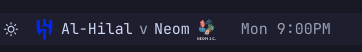
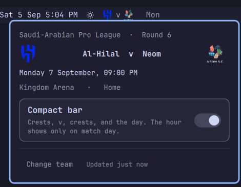

# Next Match for Omarchy

**Your team's next fixture in the bar: crest, `v`, crest, and the day.**

[](manifest.json)
[](LICENSE)
[](https://omarchy.org)


A bar widget for the [Omarchy](https://omarchy.org) shell. Pick your club and
it just runs — **no API key, no account, nothing to paste.** Fixtures come from
[TheSportsDB](https://www.thesportsdb.com), which is free and covers leagues the
big providers put behind paid plans, the Saudi Pro League among them.

- **Compact by default.** Two crests and a `v`, then the day. On match day, the
  hour too. Flip one switch for club names and the hour on every day.
- **Every competition.** League, cup, continental — whichever is next is what
  the bar shows, home or away.
- **Live scores.** The `v` becomes the scoreline while the match is on, with the
  minute beside it.
- **Quiet when it should be.** More than a week out, or off-season, the pill is
  just the icon. Click it and the detail is still there.
- **Polite to the API.** Polls by how soon the answer could change, from every
  six hours down to every three minutes during the match, and caches the last
  good answer so a shell restart shows the right fixture at once.

## Install

```bash
omarchy plugin add https://github.com/tsubaie/omarchy-next-match.git --enable
```

Click the pill, pick a **country**, then pick your **club**. That is the whole
setup. If your club is not in the list, type three letters of its name and the
widget searches for it.

## Remove

```bash
omarchy plugin remove tsubaie.next-match --yes
```

That takes the widget out of the bar and deletes the plugin folder. Your
settings entry in `~/.config/omarchy/shell.json` goes with it. The only thing
left behind is the cache of fixtures and crests, which you can delete too:

```bash
rm -rf ~/.cache/omarchy-next-match
```

The widget installs nothing else: no services, no system packages, no changes
outside its own plugin folder and that cache. It runs `curl` for API calls and
crest downloads, which Omarchy already ships.

## In the bar

Crests sit either side of the `v` in both forms. Inside a week the bar shows the
day, because that is what you plan around; the hour appears once the day is
here. Past a week it shows the icon alone.

| Until kick-off | Compact (default) | Long |
|----------------|-------------------|------|
| Today | `Today 9:00PM` | `Al-Hilal v Al-Ahli  Today 9:00PM` |
| Tomorrow | `Tomorrow` | `Al-Hilal v Al-Ahli  Tomorrow 6:00PM` |
| Later this week | `Sun` | `Al-Hilal v Al-Ahli  Sun 8:30PM` |
| More than a week away | the ⚽ alone | the ⚽ alone |
| Nothing scheduled | the ⚽ alone | the ⚽ alone |
| Being played | `2 - 1  67'` between the crests | `Al-Hilal 2 - 1 Al-Ahli  67'` |

| Compact | Long |
|---------|------|
|  |  |

Switch between them with the **Compact bar** toggle in the panel, or from a
shell. Either way it applies at once, no restart:

```bash
omarchy bar set tsubaie.next-match compact false --json
```

A club's name is drawn in compact mode only while its crest is not: before the
crest has loaded, or with `showBadge` off.

## The panel

Click the pill for the fixture in full — competition and round, both crests and
names, kick-off in your local time to the minute, venue, home or away — plus
the compact toggle and the team picker. Middle-click the pill to force a
refresh.



### Which competitions

All of them. Fixtures are looked up **by team, not by league**, so a cup tie, a
continental night or a domestic league game are all just "the next match" —
whichever comes first is what the bar shows.

### While the match is on

TheSportsDB's schedule feed lists only fixtures that have **not** started, so a
match drops out of it the moment it kicks off. Live scores come from a separate
feed covering every match being played, which the widget starts polling ten
minutes before kick-off and stops once the match has left it. Nothing to
configure; turn it off with `showLive` if you would rather not know before you
watch it back.

## Settings

All optional. Set them from the panel where there is a control for it, or from
the command line, which writes through the running shell so a symlinked
`shell.json` stays a symlink:

```bash
omarchy bar set tsubaie.next-match <key> <value> --json
```

| Key | Default | Meaning |
|-----|---------|---------|
| `teamId` | `0` | TheSportsDB team id. Set by the picker, not by hand. |
| `compact` | `true` | Crest, `v`, crest and the day, with the hour only on match day. Off adds both club names and the hour on every day. |
| `showBadge` | `true` | Show both crests. Compact, they stand in for the names; off shows the names instead. |
| `showLive` | `true` | Turn the pill into a live scoreline during the match. |
| `refreshMinutes` | `60` | Fallback interval. Matches over a day away poll no faster than every 6 hours. |
| `icon` | `⚽` | Shown when there is no fixture to draw. Any emoji or Nerd Font glyph. |
| `hideWhenIdle` | `false` | Take no space at all when nothing is scheduled. The settings are then unreachable from the bar until a fixture appears. |
| `apiKey` | shared key | Your own TheSportsDB key, if you want to avoid the shared key's rate limiting. |

## How it works

### Polling

TheSportsDB asks for courtesy rather than enforcing a hard daily cap, and a
fixture days away does not change minute to minute, so the widget paces itself
by how soon the answer could actually change:

| Situation | Interval |
|-----------|----------|
| Next match more than 24 hours away | 6 hours, or a longer configured fallback |
| Between 1 and 24 hours away | 1 hour |
| Within an hour of kick-off | 15 minutes |
| From 10 minutes before kick-off until the match ends | 3 minutes, against the live feed |
| Kick-off passed, while waiting for the schedule to change | 5 minutes |

The last structurally valid response for each team is cached to
`~/.cache/omarchy-next-match/fixture-<teamId>.json`, so restarting the shell
shows the right fixture immediately. Invalid and rate-limited responses do not
replace that cache. A refresh that arrives within a minute of the last one is
ignored to survive reload storms.

### How the club list is built

TheSportsDB's shared key returns only ten clubs per request, so one country-wide
call is not enough: for Saudi Arabia it stops at Al-Bukiryah, offering "Al Hilal
Women" but not Al-Hilal. The list is gathered from that country's competitions
instead — ten each rather than ten in total. The widget checks up to eight
competitions and merges their clubs with the country-wide results. Every row
shows its competition, so a club and its women's side are told apart.

If a club is still missing, type three letters and the widget searches by name
and folds the result in. Matching ignores punctuation, case and accents in every
direction: TheSportsDB stores `Al-Nassr` but answers a search for `Al Nassr`,
and a search for `nass` returns `Nässjö`. Results stay inside the country you
picked; when the only matches are elsewhere the widget says exactly that rather
than showing a blank list.

### Limits

The widget runs on a key shared with everyone else using it, draws crests from
a CDN it does not control, and reads a cache file anything with write access to
your home directory could replace. Nothing crossing that line is taken on trust
about its size:

| What | Ceiling |
|------|---------|
| A fixture, live or browse response | 512 KB, enforced by `curl --max-filesize` and again by `head` for a server that declares no length |
| The cache file | 256 KB, bounded by `head` at the read itself |
| One crest | 512 KB, fetched by curl to `~/.cache/omarchy-next-match/badges/team-<id>.png` and drawn from disk, so an `Image` never downloads straight from the network |
| Fixtures kept from one response | 60 |
| Clubs, in a response and in the merged list | 400 |
| Countries / competitions | 400 / 40 |
| Rows built for the picker | 300 |
| Any API string reaching a label | 120 characters |

Crest URLs must be HTTPS on `thesportsdb.com`, with no whitespace and no more
than 400 characters. An over-long URL is refused rather than truncated, since a
truncated URL points somewhere else. Every API string reaching a caption, a
placeholder or a tooltip is flattened to plain text and clamped before it gets
there.

## Troubleshooting

**It says it is rate limited.** The shared key sits behind Cloudflare, which
starts refusing with a bare `error code: 1015` under load. The widget names
that rather than calling it a connection problem, keeps the fixture it already
has, and tries again on the next tick. Your own key avoids it:

```bash
omarchy bar set tsubaie.next-match apiKey <key>
```

**A crest is missing.** The club's name is drawn in its place until the crest
arrives. Crests are fetched once and cached under
`~/.cache/omarchy-next-match/badges/`. Delete a file there and restart the
shell to fetch it again.

**The pill is just the icon.** Either nothing is scheduled or the next match
is more than a week away. Click it: the panel has the date either way.

**A change to the plugin folder did not show up.** The shell usually hot-reloads
a plugin when its files change. When it does not, `omarchy restart shell`.

## Development

```bash
node test/model.test.js          # pure logic, no network, no QML
omarchy plugin validate .        # manifest against the shell's own schema
```

`Model.js` holds the display and selection decisions worth testing: label
shape, match state, countdowns, poll pacing, key parsing and the bounds above.
Time-sensitive functions take "now" as a parameter, so their tests are
deterministic. `Panel.qml` owns fetching, state and the panel; `BarWidget.qml`
owns only the button.

To try a change on your own bar, copy the folder over the installed one and
restart the shell:

```bash
rsync -a --exclude=.git ./ ~/.config/omarchy/plugins/tsubaie.next-match/
omarchy restart shell
```

## Licence

MIT — see [LICENSE](LICENSE).

Fixture data from [TheSportsDB](https://www.thesportsdb.com). Club crests are
served by them and belong to the clubs.
