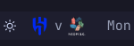
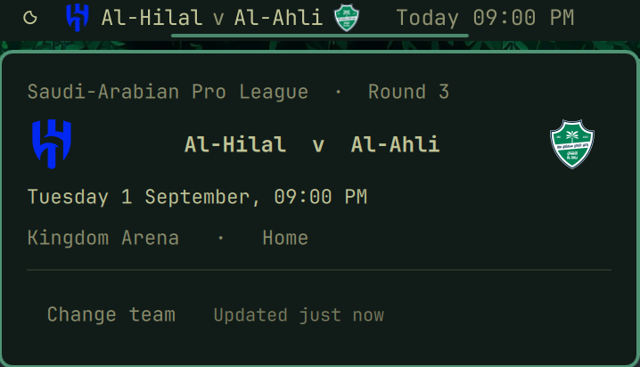

# Next Match for Omarchy

**Your team's next fixture in the bar, with both crests, counting down to
kick-off.**



A bar widget for the [Omarchy](https://omarchy.org) shell. Pick your club and
it just runs — **no API key, no account, nothing to paste.** Data comes from
[TheSportsDB](https://www.thesportsdb.com), which is free and covers leagues
the big providers put behind paid plans, the Saudi Pro League among them.

## Install

```bash
omarchy plugin add https://github.com/tsubaie/omarchy-next-match.git --enable
```

Click the pill, pick a **country**, then pick your **club**. That is the whole
setup — no key, no account, nothing to paste.

**How the club list is built.** TheSportsDB's shared key returns only ten clubs
per request, so one country-wide call is not enough: for Saudi Arabia it stops
at Al-Bukiryah, offering "Al Hilal Women" but not Al-Hilal. The list is
gathered from that country's competitions instead — ten each rather than ten in
total. The widget checks up to eight competitions and merges their clubs with
the country-wide results. Every row shows its competition, so a club and its
women's side are told apart.

If a club is still missing, type three letters and the widget searches by name
and folds the result in. Matching ignores punctuation, case and accents in
every direction, which matters more than it sounds: TheSportsDB stores
`Al-Nassr` but answers a search for `Al Nassr`, and a search for `nass` returns
`Nässjö`. Results stay inside the country you picked; when the only matches are
elsewhere the widget says exactly that, rather than a blank list.

## What it shows

In the bar, both clubs with their crests and how long you have to wait — for as
long as that is worth saying.

Inside a week you get the slot itself, because that is what you plan around:

| Until kick-off | Bar |
|----------------|-----|
| Today | `Today 09:00 PM` |
| Tomorrow | `Tomorrow 06:00 PM` |
| Later this week | `Sun 08:30 PM` |
| More than a week away | the ⚽ alone |
| Nothing scheduled | the ⚽ alone |
| Being played | the score replaces the `v`, with the minute: `Al-Hilal 2 - 1 Al-Ahli 67'` |

Past a week the pill collapses to the icon and nothing else. A fixture that far
out is not what you are glancing at the bar for, and a permanent `in 3 weeks`
is bar real estate spent on an answer that does not change. Click it and the
panel still has the date, the competition and the venue. Off-season it is the
same icon, so the widget stays somewhere you can reach its settings — set
`hideWhenIdle` if you would rather it took no space at all.

Click it for the fixture in full — competition and round, both crests and
names, kick-off in your local time, venue, home or away. Middle click forces a
refresh.



### Which competitions

All of them. Fixtures are looked up **by team, not by league**, so a cup tie, a
continental night or a domestic league game are all just "the next match" —
whichever comes first is what the bar shows. Home and away alike.

### While the match is on

`eventsnext` lists only fixtures that have **not** started, so a match drops out
of it the moment it kicks off. Live scores come from a separate feed covering
every soccer match being played, which the widget starts polling ten minutes
before kick-off and stops once the match has left it. Nothing to configure;
turn it off with `showLive` if you would rather not know before you watch it
back.

### If it says it is rate limited

The shared key sits behind Cloudflare, which starts refusing with a bare
`error code: 1015` under load. The widget names that rather than calling it a
connection problem, keeps the fixture it already has, and tries again on the
next tick. Your own key avoids it: `omarchy bar set tsubaie.next-match apiKey <key>`.

## Polling

TheSportsDB asks for courtesy rather than enforcing a hard daily cap, and a
fixture days away does not change minute to minute, so the widget paces itself
by how soon the answer could actually change:

| Situation | Interval |
|-----------|----------|
| Next match more than 24 hours away | 6 hours, or a longer configured fallback |
| Between 1 and 24 hours away | 1 hour |
| Within an hour of kick-off | 15 minutes |
| From 10 minutes before kick-off until the match ends | 3 minutes, against the live feed |
| Kick-off passed, while waiting for the schedule to change | 5 minutes |

The last structurally valid response for each team is cached to
`~/.cache/omarchy-next-match/fixture-<teamId>.json`, so restarting the shell
shows the right fixture immediately. Invalid and rate-limited responses do not
replace that cache. A refresh that arrives within a minute of the last one is
ignored to survive reload storms.

## Limits

The widget runs on a key shared with everyone else using it, draws crests from
a CDN it does not control, and reads a cache file anything with write access to
your home directory could replace. So nothing crossing that line is taken on
trust about its size:

| What | Ceiling |
|------|---------|
| A fixture, live or browse response | 512 KB, enforced by `curl --max-filesize` and again by `head` for a server that declares no length |
| The cache file | 256 KB, bounded by `head` at the read itself rather than measured once it is in memory |
| One crest | 512 KB, fetched by curl to `~/.cache/omarchy-next-match/badges/team-<id>.png` and drawn from disk — an `Image` pointed at a remote URL would download whatever was served, since `sourceSize` caps the decode and not the transfer |
| Fixtures kept from one response | 60 |
| Clubs, in a response and in the merged list | 400 |
| Countries / competitions | 400 / 40 |
| Rows built for the picker | 300 |
| Any API string reaching a label | 120 characters |

Crest URLs must be HTTPS on `thesportsdb.com`, with no whitespace and no more
than 400 characters — an over-long URL is refused rather than truncated, since
a truncated URL points somewhere else. Every API string reaching a button
caption, a placeholder or a tooltip is flattened to plain text and clamped on
this side of the boundary, rather than relying on the shell's components to
keep asking for `Text.PlainText`.

## Settings

All optional, and all settable from the command line too — which writes through
the running shell, so a symlinked `shell.json` stays a symlink:

```bash
omarchy bar set tsubaie.next-match showBadge false --json
```

| Key | Default | Meaning |
|-----|---------|---------|
| `teamId` | `0` | TheSportsDB team id. Set by the search, not by hand. |
| `showBadge` | `true` | Show both crests; off keeps the names and fixture text without them |
| `showLive` | `true` | Turn the pill into a live scoreline during the match |
| `refreshMinutes` | `60` | Fallback interval; matches over a day away poll no faster than every 6 hours |
| `icon` | `⚽` | Shown when there is no fixture to draw |
| `hideWhenIdle` | `false` | Take no space at all when nothing is scheduled |

There is no key field, because the widget works without one. If you want your
own TheSportsDB key to avoid the shared key's rate limiting, set it with
`omarchy bar set tsubaie.next-match apiKey <key>`.

## Development

```bash
node test/model.test.js          # pure logic, no network, no QML
omarchy plugin validate .        # manifest against the shell's own schema
```

`Model.js` holds the display and selection decisions worth testing — label
shape, match state, countdowns, poll pacing, key parsing and the bounds above.
Time-sensitive display functions take "now" as a parameter, so their tests are
deterministic.
`Panel.qml` owns fetching and state; `BarWidget.qml` owns only the button.

## Licence

MIT — see [LICENSE](LICENSE).

Fixture data from [TheSportsDB](https://www.thesportsdb.com). Club crests are
served by them and belong to the clubs.
